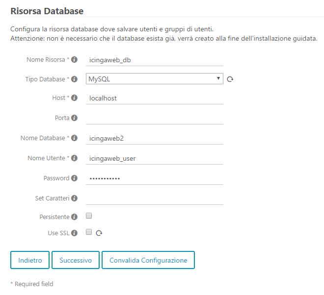
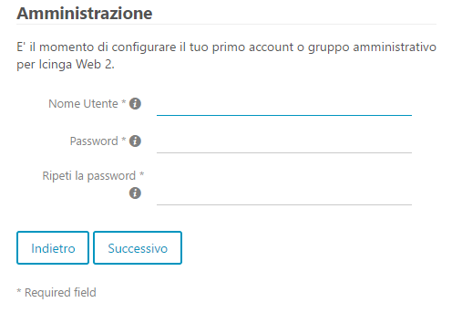

Title: Install Icinga2 on Ubuntu Server 16.04
Date: 2017-05-05
Category:
Author: Marco
Tags: linux, ubuntu, icinga
Status: draft

Icinga2 installation
--------------------

Setup repository:

    # wget -O - https://packages.icinga.com/icinga.key > key.txt
    # apt-key add key.txt
    # echo "deb https://packages.icinga.com/ubuntu icinga-xenial main" > /etc/apt/sources.list.d/icinga.list
    # apt-get update

Install main package:

    # apt-get install icinga2

Install base plugins:

    # apt-get install nagios-plugins

_NOTE_: you may want to install other plugins as well.

Restart icinga2 service:

\# sudo service icinga2 restart

That's it. Icinga2 should now be up and running. Anyway, chances are you'll want to install a nice web interface too: keep on reading then.

Icinga Web 2 installation
-------------------------

### Setup database

Install MySQL:

    # apt-get install mysql-server mysql-client

Set and take note of MySQL root user password.

Install Icinga IDO modules for MySQL:

    # apt-get install icinga2-ido-mysql

During package configuration, choose to:

*   enable ido-mysql feature in icinga
*   automatically create database
*   create a password for the default user ( _icinga2_ )

Just in case, you can always retrieve Icinga2 database password inside this file:

/etc/icinga2/features-available/ido-mysql.conf

Enable Icinga IDO feature for MySQL:

    # icinga2 feature enable ido-mysql
    # service icinga2 restart

### Setup web server

Install Apache:

    # apt-get install apache2

Install PHP:

`apt-get install php libapache2-mod-php php-mbstring php-mysql php-curl php-gettext php-intl`

Set default timezone by editing _php.ini_ file:

    # vi /etc/php/7.0/apache2/php.ini

Set it to something like this:

    date.timezone = "Europe\Rome"

**NOTE**: As per official documentation, IcingaWeb2 is not compatible with the _PageSpeed_ module, which should be disabled. I haven't bothered in doing so and that did no harm ( till now ... ).

### Prepare for web setup

Web interfaces and other Icinga addons are able to send commands to Icinga 2 through the external command pipe:

    # icinga2 feature enable command
    # service icinga2 restart

By default the command pipe file is owned by the group _nagios_ with read/write permissions. Add your webserver's user to the group _nagios_ to enable sending commands to Icinga 2 through your web interface:

    # usermod -a -G nagios www-data

Now we can proceed with _Icinga Web 2_ installation:

    # apt-get install icingaweb2

When using the web setup you are required to authenticate using a token. In order to generate a token use the _icingacli_:

    # icingacli setup token create

In case you do not remember the token you can show it using the icingacli:

    # icingacli setup token show

Visit Icinga Web 2 in your browser to access the setup wizard and complete the installation:

    http://YOURSERVERIP/icingaweb2/setup

When asked for _authentication type_, choose **Database**.

Configure a new resource database for the web frontend. Something like:

On the next step you'll be asked for a privileged MySQL user, in order to create the IcingaWeb2 database.

Create a privileged user to access IcingaWeb2 panel:

In the final step you'll be asked for coordinates and credential of the Icinga main database, the one we set up at the beginning of the article.

### References

*   [Icinga2 documentation - Getting started](https://docs.icinga.com/icinga2/latest/doc/module/icinga2/toc#!/icinga2/latest/doc/module/icinga2/chapter/getting-started)
*   [IcingaWeb2 installation on GitHUB](https://github.com/Icinga/icingaweb2/blob/master/doc/02-Installation.md)
