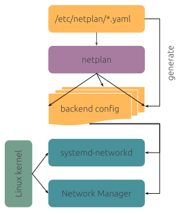

Title: Virtualbox Ubuntu guest NAT + bridge
Date: 2020-04-19
Category:
Author: Marco
Tags: virtualbox, linux, ubuntu, netplan, network
Status: draft

### 

Applies to: Virtualbox 6, Ubuntu Server 18.04 LTS guest

Using Virtualbox on office PC I've experienced the following issue: guest machine cannot reach internet when using *bridged network* while correctly reaching and, more important, being  reached from, machines on local network.

Problem arises when I want to update the machine or one of the docker containers ( it's a docker server ) tries to reach package repositories during build process. I had to turn off machine, switch to *NAT networking* and then turn on again.

Not being able to fix the issue on the bridged network ( I suspect it's something related to the routing table ), I decided to configure the VM guest using two network interfaces: one with *NAT* and the other with *bridge*.

Since the guest we're talking about is *Ubuntu Server 18.04 LTS*, networking is managed by [netplan](https://netplan.io/):

```bash
sudo cp /etc/netplan/01-netcfg.yaml /etc/netplan/01-netcfg.yaml.BAK
sudo vi /etc/netplan/01-netcfg.yaml
```

In the file below I'm refering to:

- **enp0s3** is the NATted interface
- **enp0s8** is the bridged interface
- **10.0.11.73** is the LAN address I want to set 

**Note** that office LAN covers IPs in the subnet 10.0.0.0 - 10.0.255.255, that's why I'm using netmask 16.

The modified file should look something like:

```yaml
# This file describes the network interfaces available on your system
# For more information, see netplan(5).
network:
  version: 2
  renderer: networkd
  ethernets:
    enp0s3:
      dhcp4: yes
    enp0s8:
      dhcp4: no
      addresses: [10.0.11.73/16]
```

```bash
sudo vi netplan try
```

 and press ENTER to confirm.

 